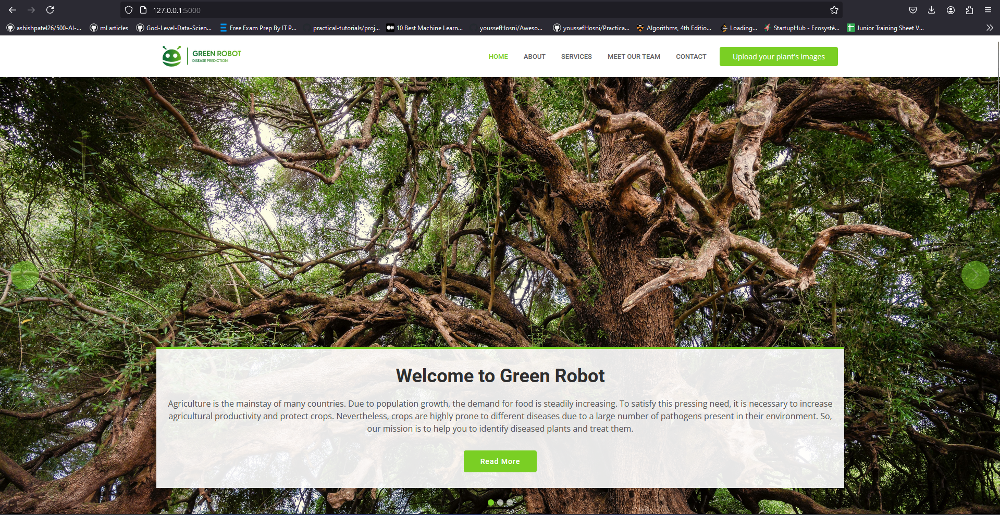

# Plant Disease Detection System

A robust system designed to detect and analyze plant diseases with ease.

---



## 🌟 **Features**
- ✅ Accurately detects diseases in a wide range of plants.
- 📖 Provides detailed insights about detected diseases, including symptoms and remedies.
- 🌱 Offers a user-friendly interface for uploading and analyzing plant images.
- 👩‍🌾 Highlights contributions from leading agronomists and researchers.

---

## 🛠 **Technologies Used**
- **[Flask](https://flask.palletsprojects.com/)**: A lightweight web framework for building scalable web applications.
- **[TensorFlow](https://www.tensorflow.org/)**: A powerful library for machine learning and deep learning tasks.
- **[OpenCV](https://opencv.org/)**: An advanced library for image processing and computer vision.
- **[NumPy](https://numpy.org/)**: A core library for numerical computations.
- **JSON**: A versatile format for structured data exchange.

---

## 🚀 **Setup Instructions**

### **Prerequisites**
Ensure the following tools and libraries are installed on your machine:
- 🐍 **Python 3.x**
- 📦 **Flask**
- 🤖 **TensorFlow**
- 🖼 **OpenCV**
- 🔢 **NumPy**

### **Installation Steps**
- Clone the repository
```bash
   git clone https://github.com/IDRISSELWAANABI/Plants-disease-detection.git
````
- For the model to work, you need first to place this folder **[models](https://drive.google.com/drive/folders/1-Za5nieJ0fxrkLlvul18skvTfdV0JcKF?usp=sharing)** in /Green/static
- Create a virtual evironment
  ```bash
  python3 -m venv venv
  source venv/bin/activate
  ````
- Install the Required Packages
```bash
pip install -r requirements.txt
````

### **Running the application**
- Navigate to the project directory
  ````bash
  cd Plants-disease-detection
  ````
- Run the Flask application
    ````bash
  python run.py
  `````
- Open your browser and go to
  ```bash
  http://127.0.0.1:5000

### **Usage**

  - Upload an image of a plant through the web interface.
  - The application will process the image and display the detected disease along with detailed information.


  


